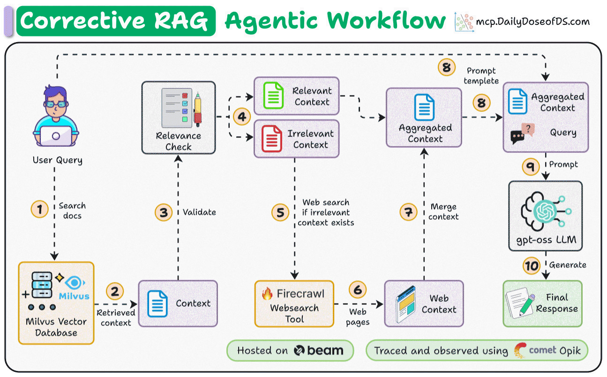

# FireCrawl Agentic RAG Workflow

This project implements an intelligent RAG (Retrieval-Augmented Generation) system using FireCrawl for web search capabilities and LlamaIndex for document processing. The system combines document retrieval with web search to provide comprehensive and accurate answers to user queries.

## Features

- **Document Upload & Processing**: Upload PDF documents for intelligent indexing
- **Corrective RAG Workflow**: Advanced workflow that combines document retrieval with web search
- **FireCrawl Integration**: Real-time web search capabilities for enhanced information retrieval
- **Streamlit UI**: User-friendly web interface for document upload and chat
- **Multiple LLM Support**: Compatible with OpenAI, Ollama, LMStudio, and other LLM providers
- **Vector Storage**: Uses Milvus for efficient document storage and retrieval
- **Relevance Filtering**: Intelligent filtering of retrieved documents for better accuracy

## Tech Stack

- **LlamaIndex**: Core RAG framework for document processing and retrieval
- **FireCrawl**: Web scraping and search API for real-time information
- **Streamlit**: Web application interface
- **Milvus**: Vector databases for document storage
- **FastEmbed**: High-performance embedding models
- **OpenAI/Litellm**: LLM integration for text generation

## Prerequisites

- Python 3.11 or later
- FireCrawl API key
- OpenAI API key (or other LLM provider)
- Sufficient disk space for document storage and caching

## Setup and Installation

### 1. Get FireCrawl API Key
- Visit [FireCrawl](https://firecrawl.dev/) and sign up for an account
- Generate an API key from your dashboard
- Store it in your environment variables

### 2. Get OpenAI API Key
- Visit [OpenAI Platform](https://platform.openai.com/) and create an account
- Generate an API key
- Store it in your environment variables

### 3. Install Dependencies

Using pip:
```bash
pip install -r requirements.txt
```

Using uv (recommended):
```bash
uv sync
```

### 4. Environment Setup
Create a `.env` file in the project root:
```bash
FIRECRAWL_API_KEY="your_firecrawl_api_key_here"
OPENAI_API_KEY="your_openai_api_key_here"
```

## Running the Project

### Option 1: Streamlit App (Recommended)
```bash
streamlit run app.py
```

### Option 2: Start Server
```bash
python start_server.py
```

### Option 3: Jupyter Notebook
```bash
jupyter notebook
```

## How It Works

1. **Document Upload**: Users upload PDF documents through the Streamlit interface
2. **Document Processing**: Documents are processed, embedded, and stored in vector databases
3. **Query Processing**: User queries are processed through the Corrective RAG workflow
4. **Retrieval**: Relevant documents are retrieved from the vector store
5. **Web Search**: If needed, FireCrawl performs web searches for additional information
6. **Answer Generation**: The LLM generates comprehensive answers using both document and web content
7. **Relevance Filtering**: Results are filtered for relevance to ensure accuracy

## Workflow Architecture

The Corrective RAG workflow consists of several key steps:



- **Start Event**: Initializes the workflow with user query
- **Retrieve**: Retrieves relevant documents from vector store
- **Web Search**: Performs web searches using FireCrawl when needed
- **Query Processing**: Combines document and web search results
- **Answer Generation**: Generates final response using LLM


## Project Structure

```
firecrawl-agent/
├── app.py                 # Main Streamlit application
├── workflow.py            # Corrective RAG workflow implementation
├── start_server.py        # Server startup script
├── pyproject.toml         # Project dependencies and configuration
├── requirements.txt       # Python package requirements
├── assets/                # Images and animations
├── hf_cache/             # HuggingFace model cache
└── README.md             # This file
```

## 🔑 Configuration

The system supports various configuration options:

- **LLM Models**: OpenAI GPT-4, Ollama models, LMStudio, etc.
- **Embedding Models**: FastEmbed models (default: BAAI/bge-large-en-v1.5)
- **Vector Stores**: Milvus
- **Timeout Settings**: Configurable workflow execution timeouts
- **Cache Settings**: HuggingFace model caching and document caching

## 🚨 Troubleshooting

### Common Issues

1. **API Key Errors**: Ensure your FireCrawl and OpenAI API keys are correctly set
2. **Memory Issues**: Large documents may require more memory; consider document chunking
3. **Timeout Errors**: Increase timeout settings for complex queries
4. **Vector Store Issues**: Clear storage directories if experiencing database corruption

### Debug Mode
Enable debug logging by setting verbose mode in the workflow initialization:
```python
workflow = CorrectiveRAGWorkflow(
    index=index,
    firecrawl_api_key=api_key,
    verbose=True,  # Enable debug logging
    llm=llm
)
```

## Contributing

Contributions are welcome! Please feel free to submit a pull request. For major changes, please open an issue first to discuss what you would like to change.

## License

This project is licensed under the MIT License - see the LICENSE file for details.

## Acknowledgments

- [LlamaIndex](https://github.com/run-llama/llama_index) for the RAG framework
- [Beam](https://github.com/beam-cloud/beta9/) for deployment
- [FireCrawl](https://firecrawl.dev/) for web scraping capabilities
- [Streamlit](https://streamlit.io/) for the web interface
- [Milvus](https://milvus.io/) for vector storage

